Berdasarkan struktur database SQL yang Anda berikan, berikut adalah **flow admin dashboard** dalam format Mermaid:

```mermaid
flowchart TD
    A[Admin Login] --> B[Dashboard Utama]
    
    B --> C[Manajemen User]
    B --> D[Manajemen Kelas]
    B --> E[Manajemen Mapel]
    B --> F[Monitor Jurnal]
    B --> G[Laporan & Statistik]
    
    C --> C1[Lihat Daftar Guru]
    C1 --> C2[Tambah Guru Baru]
    C1 --> C3[Edit Data Guru]
    C1 --> C4[Non-Aktifkan Guru]
    C3 --> C5[Update NIP/Nama/Email]
    C3 --> C6[Update Mata Pelajaran]
    C3 --> C7[Reset Password]
    
    D --> D1[Lihat Daftar Kelas]
    D1 --> D2[Tambah Kelas Baru]
    D1 --> D3[Edit Data Kelas]
    D1 --> D4[Set Wali Kelas]
    D3 --> D5[Update Kode Kelas]
    D3 --> D6[Update Nama Kelas]
    D3 --> D7[Update Fase]
    
    E --> E1[Lihat Daftar Mapel]
    E1 --> E2[Tambah Mapel Baru]
    E1 --> E3[Edit Data Mapel]
    E3 --> E4[Update Kode Mapel]
    E3 --> E5[Update Nama Mapel]
    E3 --> E6[Update Fase]
    
    F --> F1[Lihat Semua Jurnal]
    F1 --> F2[Filter by Status]
    F1 --> F3[Filter by Guru]
    F1 --> F4[Filter by Kelas]
    F1 --> F5[Filter by Tanggal]
    F2 --> F6[Published Jurnal]
    F2 --> F7[Draft Jurnal]
    F1 --> F8[Detail Jurnal]
    
    F8 --> F9[Lihat Info Utama]
    F8 --> F10[Lihat Asesmen]
    F8 --> F11[Lihat Lampiran]
    F8 --> F12[Lihat P5]
    F8 --> F13[Edit Status]
    F13 --> F14[Set Published]
    F13 --> F15[Set Draft]
    
    G --> G1[Statistik Guru]
    G1 --> G2[Jumlah Guru Aktif]
    G1 --> G3[Guru Paling Produktif]
    
    G --> G4[Statistik Jurnal]
    G4 --> G5[Total Jurnal]
    G4 --> G6[Jurnal per Bulan]
    G4 --> G7[Rasio Published/Draft]
    
    G --> G8[Statistik Kelas]
    G8 --> G9[Kelas dengan Jurnal Terbanyak]
    G8 --> G10[Distribusi Mapel]
    
    G --> G11[Export Laporan]
    G11 --> G12[Export PDF]
    G11 --> G13[Export Excel]
    
    B --> H[System Settings]
    H --> H1[Backup Database]
    H --> H2[Restore Database]
    H --> H3[Cleanup Data]
    
    %% Hubungan khusus berdasarkan foreign key
    D4 --> C1
    F3 --> C1
    F4 --> D1
    F10 --> F16[Asesmen Jurnal]
    F11 --> F17[Lampiran File]
    F12 --> F18[Projek P5]
    
    style A fill:#e1f5fe
    style B fill:#f3e5f5
    style C fill:#e8f5e8
    style D fill:#fff3e0
    style E fill:#fce4ec
    style F fill:#e0f2f1
    style G fill:#fff8e1
    style H fill:#fbe9e7
```

## 🔍 Penjelasan Flow:

### **1. Manajemen User**
- Mengelola data guru (CRUD)
- Set status aktif/non-aktif
- Reset password

### **2. Manajemen Kelas** 
- Kelola data kelas (1A, 1B, dll)
- Set wali kelas (relasi ke tabel users)
- Atur fase pembelajaran

### **3. Manajemen Mata Pelajaran**
- Kelola mapel (Matematika, Bahasa, dll)
- Atur kode dan fase

### **4. Monitor Jurnal**
- Lihat semua jurnal guru
- Filter berdasarkan status, guru, kelas, tanggal
- Ubah status jurnal (draft/published)

### **5. Laporan & Statistik**
- Statistik produktivitas guru
- Analisis distribusi jurnal
- Export laporan

### **6. System Settings**
- Backup/restore database
- Maintenance system

Flow ini mencakup semua tabel yang ada di SQL Anda: `users`, `kelas`, `mata_pelajaran`, `jurnal`, `jurnal_asesmen`, `jurnal_lampiran`, dan `jurnal_p5`.
struktur folder 
└── Views
    └── admin
        ├── layouts
        │   ├── header.php
        │   ├── sidebar.php
        │   ├── footer.php
        │   └── template.php
        ├── dashboard
        │   └── index.php
        ├── users
        │   ├── index.php
        │   ├── create.php
        │   ├── edit.php
        │   └── view.php
        ├── kelas
        │   ├── index.php
        │   ├── create.php
        │   ├── edit.php
        │   └── view.php
        ├── mapel
        │   ├── index.php
        │   ├── create.php
        │   ├── edit.php
        │   └── view.php
        ├── jurnal
        │   ├── index.php
        │   ├── view.php
        │   ├── asesmen.php
        │   ├── lampiran.php
        │   └── p5.php
        ├── laporan
        │   ├── index.php
        │   ├── guru.php
        │   ├── jurnal.php
        │   ├── statistik.php
        │   └── export.php
        └── settings
            ├── index.php
            ├── backup.php
            └── system.php